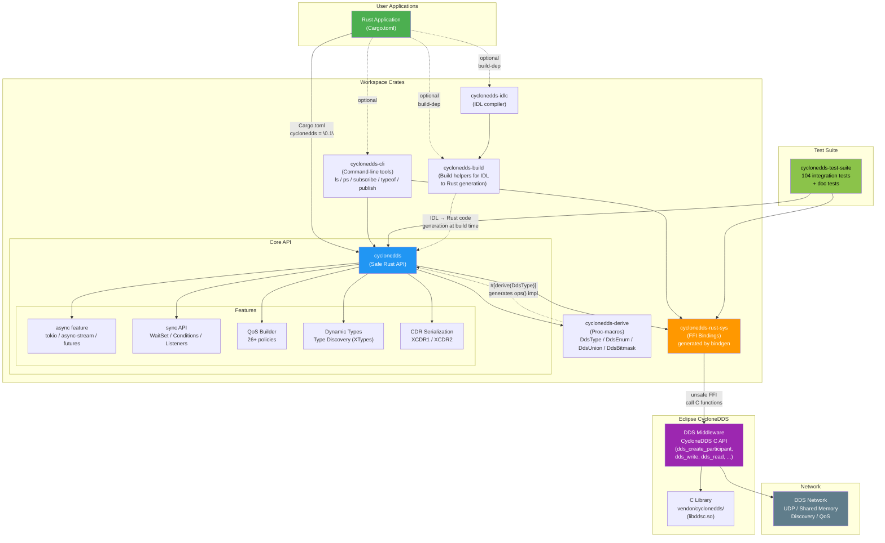
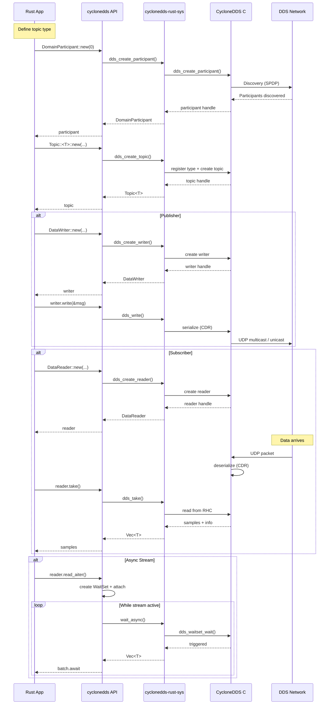
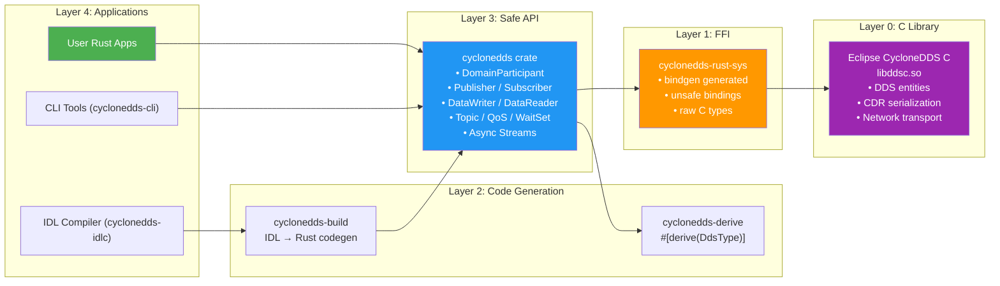

# Arquitetura cyclonedds-rust

```mermaid
flowchart TB
    subgraph "User Applications"
        APP["Rust Application\n(Cargo.toml)"]
    end

    subgraph "Workspace Crates"
        CLI["cyclonedds-cli\n(Command-line tools)\nls / ps / subscribe / typeof / publish"]
        IDLC["cyclonedds-idlc\n(IDL compiler)"]
        BUILD["cyclonedds-build\n(Build helpers for IDL\nto Rust generation)"]
        DERIVE["cyclonedds-derive\n(Proc-macros)\nDdsType / DdsEnum / DdsUnion / DdsBitmask"]
        
        subgraph "Core API"
            CYCLONE["cyclonedds\n(Safe Rust API)"]
            
            subgraph "Features"
                ASYNC["async feature\ntokio / async-stream / futures"]
                SYNC["sync API\nWaitSet / Conditions / Listeners"]
                QOS["QoS Builder\n26+ policies"]
                DYN["Dynamic Types\nType Discovery (XTypes)"]
                SERIAL["CDR Serialization\nXCDR1 / XCDR2"]
            end
        end
        
        SYS["cyclonedds-rust-sys\n(FFI Bindings)\ngenerated by bindgen"]
    end

    subgraph "Eclipse CycloneDDS"
        VENDOR["C Library\nvendor/cyclonedds/\n(libddsc.so)"]
        DDS["DDS Middleware\nCycloneDDS C API\n(dds_create_participant,\ndds_write, dds_read, ...)"]
    end

    subgraph "Network"
        NET["DDS Network\nUDP / Shared Memory\nDiscovery / QoS"]
    end

    subgraph "Test Suite"
        TEST["cyclonedds-test-suite\n104 integration tests\n+ doc tests"]
    end

    %% User dependencies
    APP -->|"Cargo.toml\ncyclonedds = \"0.1\""| CYCLONE
    APP -.->|"optional"| CLI
    APP -.->|"optional\nbuild-dep"| BUILD
    APP -.->|"optional\nbuild-dep"| IDLC

    %% CLI dependencies
    CLI --> CYCLONE
    CLI --> SYS

    %% IDLC dependencies
    IDLC --> BUILD

    %% Core API internal
    CYCLONE --> SYS
    CYCLONE --> DERIVE
    CYCLONE --> ASYNC
    CYCLONE --> SYNC
    CYCLONE --> QOS
    CYCLONE --> DYN
    CYCLONE --> SERIAL

    %% FFI to C
    SYS -->|"unsafe FFI\ncall C functions"| DDS

    %% C Library
    DDS --> VENDOR
    DDS --> NET

    %% Tests
    TEST --> CYCLONE
    TEST --> SYS

    %% Derive macro usage
    DERIVE -.->|"#[derive(DdsType)]\ngenerates ops() impl"| CYCLONE

    %% Build tools
    BUILD -.->|"IDL → Rust code\ngeneration at build time"| CYCLONE

    style APP fill:#4CAF50,color:#fff
    style CYCLONE fill:#2196F3,color:#fff
    style SYS fill:#FF9800,color:#fff
    style DDS fill:#9C27B0,color:#fff
    style NET fill:#607D8B,color:#fff
    style TEST fill:#8BC34A,color:#000
```

## Diagrama de Fluxo de Dados (Pub/Sub)

```mermaid
sequenceDiagram
    participant App as Rust App
    participant API as cyclonedds API
    participant FFI as cyclonedds-rust-sys
    participant C as CycloneDDS C
    participant Net as DDS Network

    Note over App: Define topic type<br/>#[derive(DdsType)]
    
    App->>API: DomainParticipant::new(0)
    API->>FFI: dds_create_participant()
    FFI->>C: dds_create_participant()
    C->>Net: Discovery (SPDP)
    Net-->>C: Participants discovered
    C-->>FFI: participant handle
    FFI-->>API: DomainParticipant
    API-->>App: participant

    App->>API: Topic::<T>::new(...)
    API->>FFI: dds_create_topic()
    FFI->>C: register type + create topic
    C-->>FFI: topic handle
    FFI-->>API: Topic<T>
    API-->>App: topic

    alt Publisher
        App->>API: DataWriter::new(...)
        API->>FFI: dds_create_writer()
        FFI->>C: create writer
        C-->>FFI: writer handle
        FFI-->>API: DataWriter
        API-->>App: writer
        
        App->>API: writer.write(&msg)
        API->>FFI: dds_write()
        FFI->>C: serialize (CDR)
        C->>Net: UDP multicast / unicast
    end

    alt Subscriber
        App->>API: DataReader::new(...)
        API->>FFI: dds_create_reader()
        FFI->>C: create reader
        C-->>FFI: reader handle
        FFI-->>API: DataReader
        API-->>App: reader
        
        Note over Net: Data arrives
        Net->>C: UDP packet
        C->>C: deserialize (CDR)
        
        App->>API: reader.take()
        API->>FFI: dds_take()
        FFI->>C: read from RHC
        C-->>FFI: samples + info
        FFI-->>API: Vec<T>
        API-->>App: samples
    end

    alt Async Stream
        App->>API: reader.read_aiter()
        API->>API: create WaitSet + attach
        loop While stream active
            API->>FFI: wait_async()
            FFI->>C: dds_waitset_wait()
            C-->>FFI: triggered
            FFI-->>API: Vec<T>
            API-->>App: batch.await
        end
    end
```

## Diagrama de Camadas

```mermaid
flowchart LR
    subgraph "Layer 4: Applications"
        L4A["User Rust Apps"]
        L4B["CLI Tools (cyclonedds-cli)"]
        L4C["IDL Compiler (cyclonedds-idlc)"]
    end

    subgraph "Layer 3: Safe API"
        L3["cyclonedds crate\n• DomainParticipant\n• Publisher / Subscriber\n• DataWriter / DataReader\n• Topic / QoS / WaitSet\n• Async Streams"]
    end

    subgraph "Layer 2: Code Generation"
        L2A["cyclonedds-derive\n#[derive(DdsType)]"]
        L2B["cyclonedds-build\nIDL → Rust codegen"]
    end

    subgraph "Layer 1: FFI"
        L1["cyclonedds-rust-sys\n• bindgen generated\n• unsafe bindings\n• raw C types"]
    end

    subgraph "Layer 0: C Library"
        L0["Eclipse CycloneDDS C\nlibddsc.so\n• DDS entities\n• CDR serialization\n• Network transport"]
    end

    L4A --> L3
    L4B --> L3
    L4C --> L2B
    L3 --> L1
    L3 --> L2A
    L2B --> L3
    L1 --> L0

    style L0 fill:#9C27B0,color:#fff
    style L1 fill:#FF9800,color:#fff
    style L3 fill:#2196F3,color:#fff
    style L4A fill:#4CAF50,color:#fff
```
